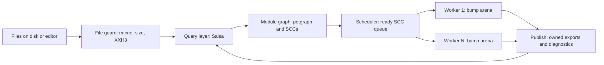

# ts-rust: High-Level Design (Draft 1)

**Status:** design before code. Nothing here is implemented yet.
**Companion:** `ts-rust-LLD.md` holds the detailed design for every decision below.
**Scope:** the checker, cross-file semantics, memory, threading and the incremental query layer. The runtime, typed IR, backends, LSP and emit are out of scope, except in section 4 where they appear as future challenges.

Items marked **[VERIFY]** depend on library behavior that should be confirmed with a small spike before building on it (spikes are listed in section 6).

---

## 1. Goals and quality attributes

**Goals**
- Correct cross-file type checking that reuses the existing semantic core (subtyping, generics, narrowing) without a rewrite.
- Incremental recheck: change a file, recheck only what its change can affect.
- File-level parallelism with deterministic output.
- Bounded memory, with explicit failure instead of silent degradation.
- Native and WASM builds from the same core.

**Quality attributes, in priority order**

| # | Attribute | Meaning here |
|---|---|---|
| 1 | Correctness and determinism | Same input gives byte-identical diagnostics, regardless of thread count or timing |
| 2 | Incremental correctness | An incremental run equals a cold run, always |
| 3 | Memory bound | Peak memory is predictable; limits fail loudly |
| 4 | Throughput | Cold and warm check time |
| 5 | Startup and size | Matters most for WASM |

When two goals conflict, the lower number wins.

---

## 2. System overview

**The one rule that organizes everything:**

> Types never cross a file arena boundary. Only *portable* data (owned, identified by stable ids) does.

### Lifetime classes

| Class | Lives for | Owner | Allocator | Contents |
|---|---|---|---|---|
| L0 scratch | one expression or statement | stack | stack (SmallVec) | temporary lists |
| L1 unit | one check unit (a file or an SCC) | worker | bump arena, reset after the unit | AST, type nodes, per-unit caches |
| L2 revision | until an input changes | query layer | Arc, immutable | exports, diagnostics, module headers |
| L3 process | the whole run | global | mimalloc heap | name interner, resolver caches, library types |

Data only moves upward (L1 to L2) by being converted to an owned, arena-independent form. Nothing in L2 or L3 may point into L1.

---

## 3. Architecture decision records

Each record has: problem, options, decision, why (the case study), cost, and when to revisit.

### ADR-1: Type identity and the arena

**Problem.** Types need O(1) identity, cheap allocation, bulk freeing, and safe handling of recursive types. Today's arena is a single `Vec<Type>` with digest-based interning for some variants, mutable placeholders completed by `set()`, and display names attached to ids through side tables.

**Options**

| | A. Status quo arena | B. Shared global interner (tsz-style) | C. Per-file bump arena, immutable nodes, lazy declaration slots | D. Salsa-interned types |
|---|---|---|---|---|
| O(1) identity | partial (unions, named copies need structural compare) | yes | yes within a file | yes |
| Mutation hazards | high: `set()` forces cache invalidation | none | none | none |
| Bulk free | no | no (append-only, capped) | yes (reset) | tied to revisions |
| Thread contention | n/a (single thread) | sharded locks, thread-local caches | none | database access on every type operation |
| Cross-file sharing | none | free | portable rebuild | free |
| Migration cost | none | high | medium | high |

**Decision: C.**

**Why**
1. *It removes a whole class of bugs.* The current arena needs `param_scan` and `equality_cache` cleared inside `set()`, and debug asserts on `set_display_name` and `make_unique`, all because slots can change after being handed out. Immutable nodes plus lazy declaration slots make those guards unnecessary.
2. *Memory is bounded per unit.* A reset returns everything at once. The shared-interner design (tsz) is append-only; to protect itself it caps at 8 million types and then returns an error type for every new type. That is a silent correctness cliff, which our priority list forbids.
3. *No contention.* Rust's `Bump` is not shareable between threads, so isolation is enforced by the compiler rather than by convention.
4. *Migration is realistic.* `TypeId` stays a `u32` handle, and `arena.get()` returns a `Copy` node, so subtyping, generics and narrowing change very little.

**Cost.** An imported type is rebuilt in each importing arena, so the same exported type can be rebuilt many times across files. Mitigations: lazy rebuild (only types actually touched), a per-arena memo from stable id to local handle, and a read-only shared set for library types if measurements demand it. As I understand it, the native TypeScript compiler (tsgo) also runs several independent checker instances and accepts duplicated work; this is the same trade-off.

**Revisit if.** Spike S5 shows rebuilding imported types costs more than a set threshold of check time.

**Primitive split.** Primitives (number, string, boolean, null, undefined, any, unknown, never, void, error) are fixed ids with no storage. Only non-primitives occupy arena slots. Details in LLD section 1.

---

### ADR-2: Memory model

**Problem.** The compiler holds many short-lived structures (AST, type nodes) and a few long-lived ones (exports, caches). It must free the first kind cheaply and the second kind safely across threads.

**Options**

| | A. Everything on the heap (Arc/Rc) | B. Bump for transient, Arc for persistent | C. One arena for the process, never freed | D. A garbage collector |
|---|---|---|---|---|
| Speed of transient alloc | slow | fast | fast | medium |
| Freeing | per object | per unit | never | tracing |
| Leak risk | cycles | spilled heap parts of bump objects | unbounded growth | none |
| Complexity | low | medium | low | high |

**Decision: B, with strict rules.**
- Nodes in a bump arena hold only `Copy` data and arena references. Nothing inside needs `Drop`.
- Persistent data is `Arc`, immutable, and contains no pointers into any arena.
- Cyclic persistent data uses indices, not pointers, so reference counting cannot leak cycles.
- `Rc` is allowed only for thread-confined state (for example one editor session). Crossing threads requires `Arc` or an owned message.
- mimalloc is the global allocator on native targets.

**Why.** Bumpalo does not run destructors, so any `SmallVec` that spills or any `Rc<str>` stored inside a bump node leaks on every reset. The rules above make that unrepresentable, and a compile-time assertion can enforce it (LLD 2.2). Reference counting is the right tool only for data that outlives a unit, which is a small, easily bounded set.

**Cost.** Discipline: contributors must copy scratch data into the bump rather than store a `Vec`.

**Revisit if.** Profiling shows `Arc` traffic dominating a hot path (then switch that path to ids or borrowed data).

**Runtime note.** The memory model for a future runtime (JS objects, closures, cycles) is a separate decision, not covered here (section 4, item 10).

---

### ADR-3: Concurrency model

**Problem.** Use many cores without making the checker nondeterministic or lock-heavy.

**Options**

| | A. Single thread | B. Shared mutable checker with locks | C. File-level parallelism, isolated arenas, SCC as the unit of work | D. Parallelism inside a file |
|---|---|---|---|---|
| Determinism | easy | hard | achievable (ordered publication) | hard |
| Hot-path locking | none | yes | none | yes |
| Speedup | none | limited by contention | scales with independent files | limited |
| Implementation risk | low | high | medium | high |

**Decision: C.**

**Pipeline**
1. *Stage 1 (parallel):* read files, hash them, and extract each file's module header (import specifiers, export names). Results flow through a bounded channel and are re-ordered by file index.
2. *Stage 2 (scheduled):* check import-cycle groups (SCCs) in dependency order. A group is ready when everything it imports has published. Ready groups go to a worker pool; each worker owns one bump arena and resets it after every unit.

**Why**
- *Determinism by construction.* Output order depends on file order, never on which thread finished first.
- *No locks on the hot path.* Workers share only immutable published results.
- *Cycles are handled once.* A circular import group is checked as one unit in one arena, so its members share type handles directly and no cross-arena resolution is needed inside a cycle.

**Cost.** One very large cycle (for example a barrel-file cycle) runs serially. Syntax trees are not sent between threads in v1: files are parsed once for the header and again inside the worker that checks them (LLD 5.2).

**Revisit if.** Measurements on real projects show one SCC taking a large share of wall time (see section 4, item 2).

---

### ADR-4: Incremental query layer

**Problem.** After an edit, recheck only what can be affected, and prove the result equals a cold run.

**Options**

| | A. No incrementality | B. File-level invalidation with reverse dependencies | C. Salsa with coarse queries and early cutoff | D. Hand-written dependency graph (rustc style) | E. Everything as Salsa queries, including types |
|---|---|---|---|---|---|
| Edit to a function body | recheck all | recheck all dependents | recheck that file only | same as C | same as C, higher overhead |
| Engineering cost | none | low | medium | high | high |
| Per-operation overhead | none | none | small (per file) | small | large (per type or expression) |
| Correctness burden | none | low | outputs must be owned and comparable | all on us | high |

**Decision: C, applying the rustc principles; petgraph is used for module topology only.**

The rustc ideas adopted: record what each query read; fingerprint outputs; if a recomputed output is equal to the old one ("green"), downstream queries are not rerun; never create a query per expression.

**Why**
- *The case that matters:* an edit that doesn't change a file's exported signature. Under B every importer is rechecked. Under C the file's `module_exports` result is unchanged, so no importer reruns. For a widely imported utility file this is the difference between rechecking dozens of files and one.
- *Why not E:* queries have a fixed overhead per call. A checker performs millions of type operations, so putting each one behind a memoized query would cost more than it saves, and it would force type data to be owned and comparable, which fights the per-file arena.
- *Why not D:* it means rebuilding dependency tracking, backdating, cycle handling and parallel safety that Salsa already provides. Keep it as a fallback if Salsa's constraints bite.
- *Division of labor:* Salsa answers "must this be recomputed?". Petgraph answers "in what order, and which files are in a cycle?".

**Cost**
- Query outputs must be owned, comparable, and independent of any arena.
- Salsa cannot see file-system reads, so module resolution results need an explicit invalidation signal (LLD 6.4).
- Interaction between Salsa's database handles, cancellation and our scheduler needs a spike **[VERIFY]**.

**Revisit if.** Spike S1 shows Salsa cannot give per-declaration cutoff with acceptable overhead.

---

### ADR-5: Stable identity across files and revisions

**Problem.** A type declared in `b.ts` and used in `a.ts` must be referable without sharing an arena, and survive edits that move code around.

**Options**

| | A. AST node ids or spans | B. Oxc symbol ids | C. Path-based declaration key plus signature hash | D. Hash of the full resolved structure |
|---|---|---|---|---|
| Stable across edits above the declaration | no | no (dense, reassigned) | yes | yes |
| Stable across files | no | no (file-local) | yes | yes |
| Handles recursive types | n/a | n/a | yes (see below) | needs cycle-aware canonical form |
| Cost | cheap | cheap | cheap | expensive |

**Decision: C.** A **declaration key** is a 128-bit hash of the module key and the declaration's local name (plus a disambiguator for merged or overloaded declarations). A **signature hash** is a 128-bit hash of the declaration's own public shape, where any reference to another declaration is recorded by that declaration's key, not its shape.

**Why this breaks cycles.** In TypeScript, recursion passes through named declarations (interfaces, classes, aliases). Encoding stops at a named reference, so `interface Node { next: Node }` hashes without ever recursing into itself. Changes in a referenced declaration are still tracked, because reading that declaration's shape is a recorded query dependency, not part of this hash.

**Refinement of your earlier chunk-id decision (needs your confirmation).** You decided on a chunk id made of module, local name and signature hash. This design keeps all three, but separates them: identity is module plus name, and the signature hash is its version. References between declarations use identity only. If the signature hash were part of the identity used inside references, two declarations that refer to each other could not both be hashed.

**Why 128 bits and a strong hash.** At 128 bits an accidental collision is negligible (about 10⁻²⁵ at 8 million types). The in-memory Fx hasher is not suitable for this role; use XXH3-128 (or a truncated cryptographic hash if untrusted input is a concern).

---

### ADR-6: Determinism and resource limits

**Rules**
1. Publication order is by file index (path-sorted), never completion order.
2. Anything iterated into output is an ordered map or a sorted vector.
3. Hashing used for identity is an explicit, versioned byte encoding, not `#[derive(Hash)]`.
4. Diagnostics sort by (file, start, code, message).
5. Budgets (types per unit, instantiation depth, bump bytes) abort the unit with a diagnostic and mark the result **incomplete**; incomplete results are never treated as authoritative cache entries.

**Why.** The shared-interner design we studied degrades silently past its cap and uses a global allocation counter for ordering; both are exactly what these rules rule out. Enforcement is by tooling (clippy `disallowed_*` lists, a repeated-run determinism test), not by review alone.

---

## 4. Where more challenges will come (ranked)

| # | Challenge | Why it is hard | Early signal | Mitigation |
|---|---|---|---|---|
| 1 | Inferred exports and declaration-level cycles | An unannotated export's type depends on checking its body, which may depend on other modules. This couples "shape" to "body" and creates real type cycles. | A consumer must wait for an upstream file's body check | Split each unit into a declare phase and a bodies phase; fast path for annotated exports; per-declaration cycle detection (LLD 4.4) |
| 2 | One giant import cycle | SCC is the unit of work, so it is serial | One unit dominates wall time in the harness | Measure first; consider declaration-level lazy resolution later |
| 3 | Module resolution is invisible to the query layer | File adds, deletes, renames, package.json, symlinks and path mappings change results without any source edit | Stale results after a rename | Explicit resolution epoch input; treat resolver caches as keyed data |
| 4 | Ambient and global scope | Library types, global augmentation, module augmentation and declaration merging across files break per-file isolation | Merged interfaces differ between a cold and an incremental run | Treat library and ambient declarations as a shared read-only portable set; merge by declaration key |
| 5 | Generic instantiation explosion across files | Instantiation memo is per arena; recursion limits matter | Memory or time spike on generic-heavy code | Depth and node budgets; shared memo for library generics later |
| 6 | Duplicate rebuilding of imported types | Isolation costs repeated work | Materialization shows up in profiles | Lazy rebuild; memo by stable id; measure (S5) |
| 7 | Cancellation and editor edits | A running check may be invalidated mid-way | LSP shows stale or partial results | Check cancellation at unit boundaries and every N statements; discard partial output |
| 8 | WASM | No native threads by default, no mimalloc, size limits | Bundle size or memory blow-up | Single-thread mode behind the same scheduler interface; separate build profile (already in place) |
| 9 | Diagnostic fidelity and cost | Matching tsc ordering and wording, and printing types lazily | Mismatch with the comparison harness | Keep the existing compare tooling; render types before arena reset |
| 10 | Runtime and typed IR (future tsr work) | Types are structural and unsound, so layouts cannot always be static; needs a value representation, memory management for cycles, JS semantics without V8, and N-API | Cannot lower a given construct without a dynamic fallback | Decide value representation and cycle strategy before any backend work |
| 11 | Dependency churn | Salsa and Oxc APIs change between versions | Upgrade breaks queries | Pin versions; isolate behind a thin adapter |

---

## 5. Evidence from reference designs

| | ts-rust today | tsz | rustc | tsgo |
|---|---|---|---|---|
| Type storage | one `Vec`, digest interning for some variants | sharded concurrent interner, thread-local cache in front | arena-allocated, interned, compared by pointer | one type universe per checker instance |
| Mutation after creation | yes (`set()`) | no (lazy definition references) | no | not applicable |
| Limits | none | 8M types, then error type | memory only | memory only |
| Cross-file types | none yet | shared directly | shared | per-checker duplicate |
| Incremental | none | none that I found | query system with a red-green dependency graph and 128-bit fingerprints | none (fast full check) |
| Parallelism | none | worker threads over shared interner | parallel front end work in progress | multiple checkers over file subsets |

The ts-rust and tsz columns come from reading their source. The rustc and tsgo columns are from general knowledge and should be treated as **[VERIFY]**.

---

## 6. Delivery plan

**Spikes (small experiments, each answers one risk)**

| # | Question | Pass condition |
|---|---|---|
| S1 | Does Salsa give early cutoff with owned outputs, per-declaration projections and parallel handles? | Body edit does not rerun importers; two threads share one database safely |
| S2 | Is the stable hash stable? | Same type hashes identically across arena creation orders, resets and process runs |
| S3 | Does Oxc's allocator and AST behave with per-worker reset? | No leaks or use-after-reset under the worker model |
| S4 | How big are real SCCs? | Measured on Zustand and one large project |
| S5 | What does rebuilding imported types cost? | Under the agreed share of check time |

**Stages (each ends with the repo building, tests passing, and nothing regressed)**

| Stage | Content | Exit criteria |
|---|---|---|
| 0 | Freeze identity, Salsa scope and cycle rules; resolve open decisions (section 7) | This pair of documents signed off |
| 1 | Lazy declaration slots and immutable nodes in the single-file checker | All existing fixtures pass unchanged |
| 2 | Stable ids, portable types, cross-file imports (sequential) | Cross-file fixtures pass; hash tests pass |
| 3 | Module graph, SCC condensation, project driver | Deterministic multi-file output |
| 4 | Salsa layer | Invalidation matrix (LLD 6.5) passes |
| 5 | Parallel scheduler | Output identical across thread counts |

---

## 7. Decisions

Locked at stage 0. Each stays as decided until the spike or measurement named in it says otherwise. The same list, with what would reopen each one, is in `docs/decisions.md`.

1. **Identity versus version: split.** `DeclKey` is identity and `SigHash` is version (ADR-5). A signature inside the id would change the id of every referrer on each edit and defeat early cutoff.
2. **Aliases: transparent wrapper nodes** (`Named`, LLD 1.8). A side table keyed by id is what forces today's `set()` and `make_unique` guards.
3. **Union display order: first writer wins, in a side table.** Identity stays canonical, and messages keep the order as written, which is closest to what tsc prints. Accepted limit: two unions written in different orders print in whichever order was seen first.
4. **v1 unit of work: one SCC.** Cycle members share one arena, so nothing is shared across arenas inside a cycle. Reopen only if S4 shows a single SCC dominating wall time.
5. **Hash function: XXH3-128.** Already a dependency (`xxhash-rust`, `xxh3`). A truncated cryptographic hash stays available behind a flag for untrusted input.
6. **When to compute the 128-bit hash: lazily, when a type reaches an export boundary.** Most types never leave their file.
7. **Salsa: `=0.28.5`, provisional.** Reopen if S1 fails.
8. **Module key: by the rule in LLD 3.1.1, never by `FileId`.**
9. **`FileId` is a run-local index, sorted by canonical path.** It orders output and indexes arrays. It is never hashed, stored, or part of any key.
10. **Intersection identity is ordered, deduplicated by id, never sorted.** Call-signature order depends on member order, and whether a member is callable needs a body that may not exist at construction. `A & B` and `B & A` are two ids that are mutually assignable, as in tsc 5.9.3. LLD 1.13.
11. **Intersection reduction is split in two.** Construction reads only ids and `Named`/`App` wrappers, never a `Ref`'s body: flatten, identity and absorbing members, primitives and literals, distribution over unions, dedupe by id. Anything that needs a body (discriminant conflicts, property merging, callable detection) runs on demand, is cached per generation, and is never part of identity. LLD 1.13.
12. **Distribution cap: a product of union sizes of 100,000 or more is TS2590,** as in tsc. Reopen if the ADR-6 budgets need it lower.
